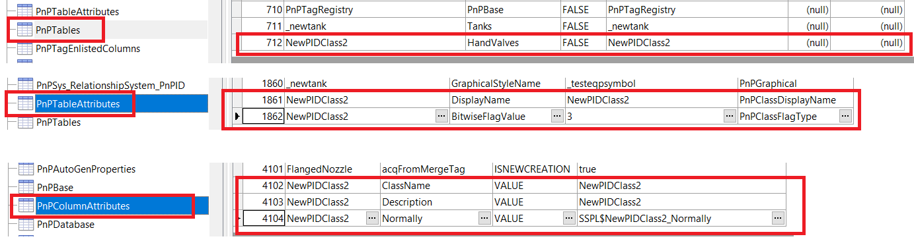

# AddingPnIDclasses
Example code to show how to add P&amp;ID classes to the Plant 3D configuration, use at own risk..

AUTHOR PROVIDES THIS PROGRAM "AS IS" AND WITH ALL FAULTS.
AUTHOR SPECIFICALLY DISCLAIMS ANY IMPLIED WARRANTY OF
MERCHANTABILITY OR FITNESS FOR A PARTICULAR USE.  AUTHOR
DOES NOT WARRANT THAT THE OPERATION OF THE PROGRAM WILL BE
UNINTERRUPTED OR ERROR FREE.

This example is adding the "NewPIDClass2" under the HandValves item in the P&ID classes tree.
"HandValves" is specified as the "base table", as you can see in the code in the following line:

PnPTable pidClass = new PnPTable("NewPIDClass2" , db.Tables["HandValves"], false);

The code is doing entries into the "PnPTables", into the "PnPTableAttributes" table and into the "PnPColumnAttributes" table.
The same entries you will find in these tables when you create manually.
So these entries appear to be the minimum entries to create a new P&ID class.

For sure you want to add more information to your new class, so (as a recommendation) create all this manually in the configuration and check the resulting entries in the tables (above), so you can do the same with your code.

